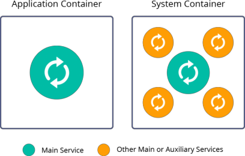

# Tipe-tipe Container dan Penggunaanya
The PaaS combines two types of containers in a single platform. These containerization technologies are oriented to solve different problems, but platform orchestration inherits benefits of both implementations.

Di sini, kami menawarkan garis besar yang konsisten dari komponen platform yang mendasarinya dengan petunjuk ke dokumentasi yang sesuai, yaitu:
- [Cloudlet](#cloudlet)
- [Container](#container)
- [Layer](#layer)
- [Environment](#environment)
- [Application](#application)
- [Host](#host)
- [Environment Region](#environment-region)
- [Platform Installation](#platform-installation)
- [Cloud Union](#cloud-union)

## Cloudlet {#cloudlet} 

## Container {#container}

## Layer {#layer}

## Environment {#environment}

## Application {#application}

## Host {#host}

## Environment Region {#environment-region}

## Platform Installation {#platform-installation}

## Cloud Union {#cloud-union}

## Langkah Selanjutnya

